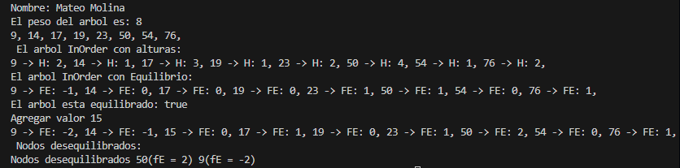

# Árbol Binario de Búsqueda - Práctica de Estructuras No Lineales

## 📌 Información General

- **Título:** Implementación de Árbol Binario de Búsqueda (ABB)
- **Asignatura:** Estructura de Datos
- **Carrera:** Computación
- **Estudiante:** Mateo Molina
- **Fecha:** 19/06/2025
- **Profesor:** Ing. Pablo Torres

---

## 🛠️ Descripción

Este proyecto implementa un Árbol Binario de Búsqueda (ABB) en Java, permitiendo:

- Insertar nodos en el árbol.
- Calcular el peso (cantidad de nodos) y la altura del árbol.
- Imprimir el árbol en recorrido inorden, mostrando también la altura y el factor de equilibrio de cada nodo.
- Verificar si el árbol está equilibrado.
- Agregar nodos manualmente.
- Identificar e imprimir los nodos desequilibrados.

La lógica principal se encuentra en [`materia.controllers.ArbolBinario`](src/materia/controllers/ArbolBinario.java) y los nodos están definidos en [`materia.models.Nodo`](src/materia/models/Nodo.java).

---

## 🚀 Ejecución

Para compilar y ejecutar el proyecto desde la terminal:

```sh
javac -d bin src/App.java src/materia/controllers/ArbolBinario.java src/materia/models/Nodo.java
java -cp bin App
```

---

## 🧑‍💻 Ejemplo de Salida





```plaintext
Nombre: Mateo Molina
El peso del arbol es: 8
La altura del arbol es: 4
El arbol InOrder: 
9, 14, 17, 19, 23, 50, 54, 76, 
El arbol InOrder con alturas: 
9 -> H: 1, 14 -> H: 2, 17 -> H: 3, 19 -> H: 1, 23 -> H: 2, 50 -> H: 4, 54 -> H: 1, 76 -> H: 2, 
El arbol InOrder con Equilibrio: 
9 -> FE: 0, 14 -> FE: 1, 17 -> FE: 1, 19 -> FE: 0, 23 -> FE: 1, 50 -> FE: 2, 54 -> FE: 0, 76 -> FE: 1, 
El arbol esta equilibrado: false
Agregar valor 15
9 -> FE: 0, 14 -> FE: 1, 15 -> FE: 0, 17 -> FE: 2, 19 -> FE: 0, 23 -> FE: 1, 50 -> FE: 3, 54 -> FE: 0, 76 -> FE: 1, 
Nodos desequilibrados:
Nodos desequilibrados 17(fE = 2) 50(fE = 3) 
```

---

## 📂 Estructura del Proyecto

```
src/
  App.java
  materia/
    controllers/
      ArbolBinario.java
    models/
      Nodo.java
```

---

## 📄 Notas

- El proyecto está configurado para usar la carpeta `src` como fuente y `bin` como salida de compilación.
- No requiere librerías externas.
- Puedes modificar los valores insertados en el árbol editando el método `main` en [`App`](src/App.java).

---